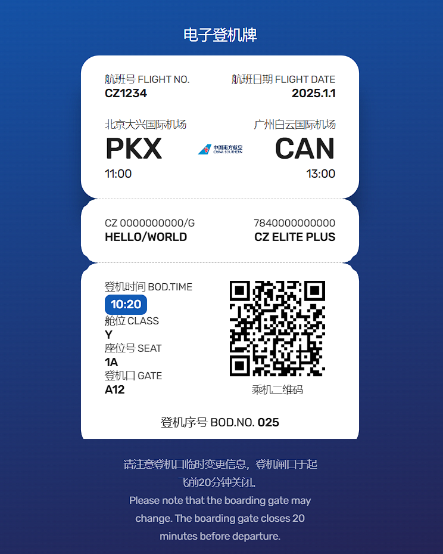

<div align="center">
  
  <h1><a href="https://github.com/cornjosh/one-boarding">One-boarding</a></h1>
  <em>Beautiful customizable boarding pass generator with real IATA BCBP QR codes</em>
</div>

<p align="center">


</p>

<h5 align="center">One-boarding 是一个开源的登机牌生成器，可以创建美观、自定义的登机牌界面，包含真实可用的乘机二维码（基于 IATA Bar Coded Boarding Pass 标准）。支持14种语言的国际化界面。</h5>

> 🎯 **快速预览**: [https://one-boarding.linkyou.top/](https://one-boarding.linkyou.top/)

---

[English](/README.md) | [日本語](/README_JA.md) | [한국어](/README_KO.md) | [Français](/README_FR.md) | [Deutsch](/README_DE.md) | [Español](/README_ES.md) | [Русский](/README_RU.md)

---

## 项目概述 ✨

`One-boarding` 生成美观、自定义的登机牌界面，包含根据 IATA Bar Coded Boarding Pass 格式生成的真实乘机二维码。

## 截图展示 ✨

<div align="center">
    
</div>

## 功能特性 🎯

### ✈️ 登机牌信息展示
- [x] **航班信息**：显示航班号、航班日期、出发机场和到达机场的信息
- [x] **乘客信息**：包括乘客姓名、票号、会员ID 和会员等级等信息
- [x] **登机信息**：显示登机时间、舱位代码、座位号和登机口等信息
- [x] **二维码**：生成真实可用的乘机二维码（符合 IATA BCBP 标准）

### 🌍 国际化支持 (i18n)
本项目支持 **14 种语言**，可在登机牌页面选择不同的显示语言：

#### 支持的语言
- **zh-Hans**: 简体中文 🇨🇳
- **zh-Hant**: 繁體中文 🇹🇼 
- **en-US**: English (United States) 🇺🇸
- **fr-FR**: Français (France) 🇫🇷
- **de-DE**: Deutsch (Deutschland) 🇩🇪
- **es-ES**: Español (España) 🇪🇸
- **pt-PT**: Português (Portugal) 🇵🇹
- **it-IT**: Italiano (Italia) 🇮🇹
- **ru-RU**: Русский (Россия) 🇷🇺
- **ja-JP**: 日本語 (日本) 🇯🇵
- **ko-KR**: 한국어 (대한민국) 🇰🇷
- **tr-TR**: Türkçe (Türkiye) 🇹🇷
- **pl-PL**: Polski (Polska) 🇵🇱
- **hu-HU**: Magyar (Magyarország) 🇭🇺

#### 语言切换方式
1. **自动检测**: 根据浏览器语言自动选择对应语言
2. **URL参数**: 通过 `?lang=language-code` 指定语言，如 `?lang=en-US`
3. **页面选择器**: 使用页面右上角的语言选择下拉框
4. **本地存储**: 选择的语言会保存在浏览器中，下次访问时自动应用

#### 翻译内容
所有登机牌相关的航空术语都根据各地区的习惯进行了专业翻译，包括：
- 登机牌标题和字段标签
- 航空术语（航班号、登机口、座位等）
- 表单标签和占位符文本
- 按钮文本和提示信息

### 🏗️ 技术特性
- [x] **单文件部署**: 主要包含单一 HTML 文件，方便部署
- [x] **响应式设计**: 适配桌面和移动设备
- [x] **实时预览**: 即时查看登机牌效果
- [x] **自定义信息**: 支持自定义所有登机牌字段
- [x] **航司支持**: 支持多家航空公司logo显示

## 项目结构 📁

项目使用简约架构，配合外部 JavaScript 库和 JSON 翻译文件实现国际化：

```
one-boarding/
├── index.html          # 主 HTML 文件，包含完整的登机牌生成器
├── js/
│   ├── i18n.js        # 国际化功能实现，处理语言加载和文本替换
│   ├── bcbp.min.js    # IATA BCBP 二维码生成库
│   └── qrcode.min.js  # 二维码生成库
├── locales/           # 各语言的翻译文件
│   ├── zh-Hans.json   # 简体中文
│   ├── en-US.json     # 英语
│   └── ...            # 其他语言文件
├── img/               # 航司 logo 文件
│   ├── 3u.png        # 四川航空
│   ├── ca.png        # 中国国际航空
│   └── ...           # 其他航司 logo
└── readme/           # README 相关资源
    └── main.png      # 项目截图
```

## 快速开始 🚀

### 安装与部署

1. **克隆仓库**:
   ```bash
   git clone https://github.com/cornjosh/one-boarding.git
   cd one-boarding
   ```

2. **本地开发**:
   ```bash
   # 直接在浏览器中打开 index.html
   open index.html
   
   # 或使用本地服务器
   python -m http.server 8000
   # 访问 http://localhost:8000
   ```

3. **在线体验**:
   直接访问: [https://one-boarding.linkyou.top/](https://one-boarding.linkyou.top/)

### 使用说明
1. 在浏览器中打开 `index.html` 文件查看登机牌页面
2. 点击"使用演示信息"按钮打开模态对话框
3. 在模态框中输入相关信息，生成包含你的数据的登机牌
4. 生成的二维码符合 IATA BCBP 标准，可用于实际登机验证

### 支持的航空公司
项目支持以下航空公司的 logo：
- 四川航空 (`3u`)
- 春秋航空 (`9c`) 
- 中国国际航空 (`ca`)
- 中国南方航空 (`cz`)
- 海南航空 (`hu`)
- 厦门航空 (`mf`)
- 中国东方航空 (`mu`)

你可以通过将相应的航司 logo 文件添加到 `img/` 目录来支持更多航空公司。

## 兼容性 🔧

在现代浏览器（Chrome、Firefox、Safari 等）中进行了测试。旧版本的浏览器中可能会出现样式或功能问题。

**系统要求:**
- 现代浏览器 (Chrome 60+, Firefox 55+, Safari 12+, Edge 79+)
- JavaScript 支持
- 互联网连接（用于加载字体和资源）

## 贡献 🤝

欢迎为 One-boarding 项目做出贡献！

### 🐛 错误报告
- 在 GitHub 上创建 issue 描述问题
- 包括浏览器版本和操作系统信息
- 提供复现步骤和错误截图

### 💡 功能建议
- 提出新功能或改进建议
- 解释使用场景和期望结果

### 🌍 翻译贡献
- 帮助改进现有语言翻译
- 添加新语言支持
- 更新文档翻译

### 💻 代码贡献
- Fork 项目仓库
- 创建功能分支
- 提交 Pull Request 并提供清晰的描述

## 开发路线图 📋

### 当前版本 (v2.0)
- [x] 添加了国际化支持，支持 14 种语言选项
- [x] 实现了 IATA BCBP 标准二维码生成
- [x] 响应式设计优化

### 未来计划
- [ ] 微信分享功能
- [ ] 支持更多航司 logo
- [ ] 移动应用版本
- [ ] 批量生成功能
- [ ] 自定义主题和样式

## 致谢 💐

本项目受到以下优秀项目的启发和帮助：

### 项目参考
- [**@georgesmith46/bcbp**](https://github.com/georgesmith46/bcbp) - IATA Bar Coded Boarding Pass 编码/解码库
- [**@mavinii/boarding-pass**](https://github.com/mavinii/boarding-pass) - 登机牌设计参考

特别感谢所有贡献者和测试者的支持！🙏

---

🎫 **One-boarding** ©Josh Zeng. 在 MIT 许可证下发布。

由 Josh Zeng 创建和维护。

[@Blog](https://linkyou.top/) · [@GitHub](https://github.com/cornjosh) · [在线演示](https://one-boarding.linkyou.top/)